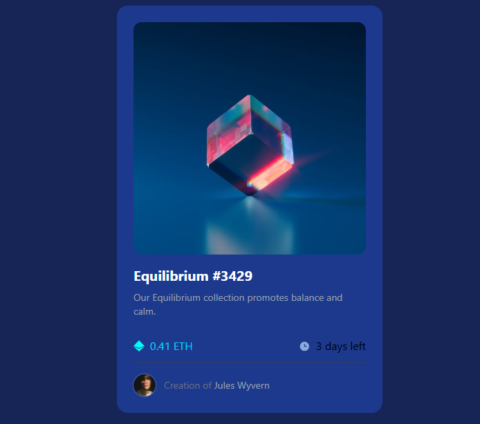

# Frontend Mentor - NFT preview card component solution

This is a solution to the [NFT preview card component challenge on Frontend Mentor](https://www.frontendmentor.io/challenges/nft-preview-card-component-SbdUL_w0U). Frontend Mentor challenges help you improve your coding skills by building realistic projects.

## Table of contents

- [Overview](#overview)
  - [The challenge](#the-challenge)
  - [Screenshot](#screenshot)
  - [Links](#links)
- [My process](#my-process)
  - [Built with](#built-with)
  - [What I learned](#what-i-learned)
  - [Continued development](#continued-development)
  - [Useful resources](#useful-resources)
- [Author](#author)
- [Acknowledgments](#acknowledgments)

**Note: Delete this note and update the table of contents based on what sections you keep.**

## Overview


### The challenge

Users should be able to:

- View the optimal layout depending on their device's screen size
- See hover states for interactive elements

### Screenshot


### Links

- Solution URL: https://github.com/Barnabas001/nft-preview
- Live Site URL: https://nft-preview-ten-silk.vercel.app/

## My process

### Built with

- Flexbox
- Mobile-first workflow
- [React](https://reactjs.org/) - JS library
- [Tailwind]
- [Typescript]

### What I learned

i used this project to practice my tailwind properly

To see how you can add code snippets, see below:

````html
<div
  className="absolute insect-0 bg-cyan-400/50 opacity-0 group-hover:opacity-100 duration-300 flex item-center justify-center"
>
  
</div>
``` ### Continued development Make component more reusable ## Author - Website -
[Barnabas Olayinka Affonshike] - Frontend Mentor -
[@Barnabas001]https://www.frontendmentor.io/profile/Barnabas001 -
Acknowledgments: All thanks to my mentor and big brother Mr Itunu for the steady
motivation
````
